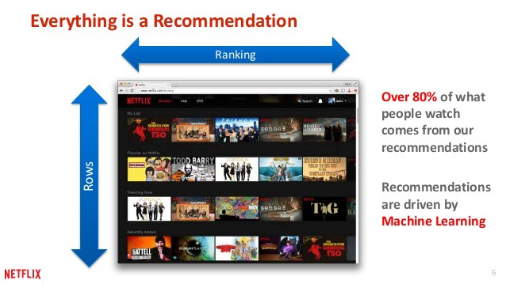
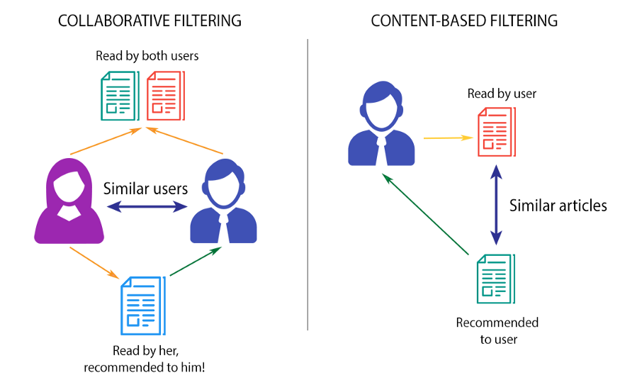
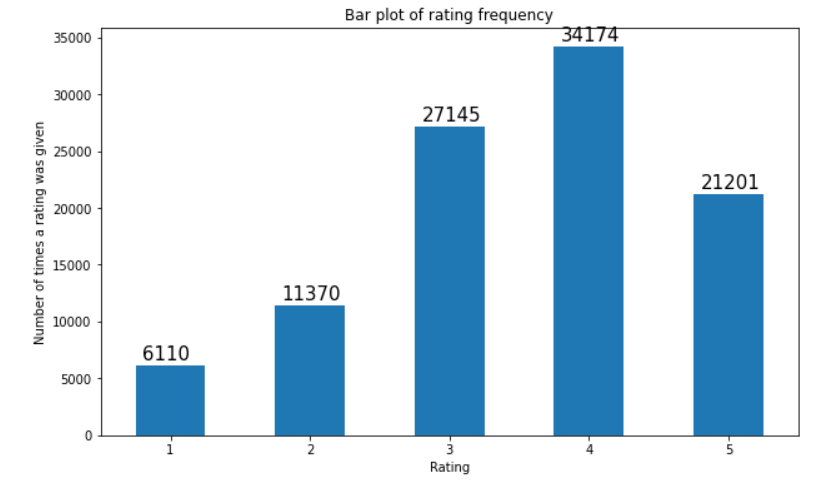
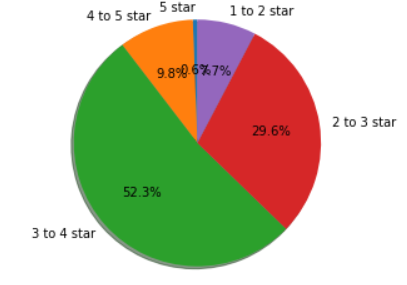
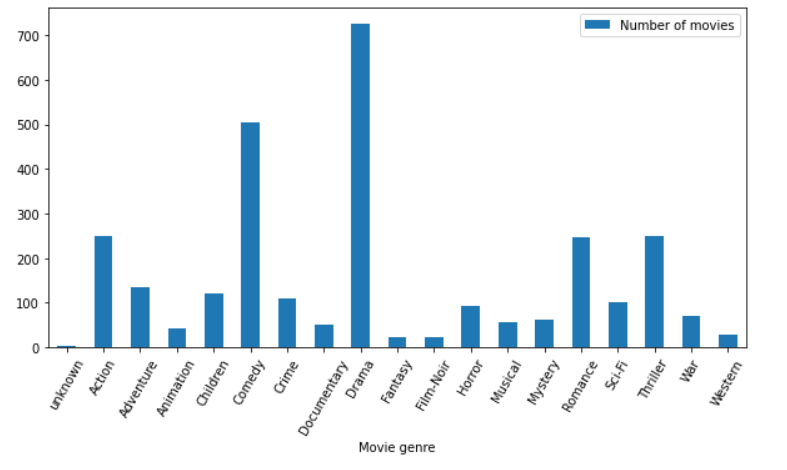

# Recommender-System-on-MovieLens-dataset
## Project Overview
Knowledge-based, Content-based and Collaborative Recommender systems are built on MovieLens dataset with 100,000 movie ratings using Pandas operations and by fitting KNN, SVD & deep learning models along with NLP techniques usage to suggest movies for the users based on similar users and for queries specific to genre, user, movie, rating, popularity.




## Recommender System Overview
A recommender system is a subclass of information filtering system that seeks to predict the "rating" or "preference" a user would give to an item. Recommender systems are utilized in a variety of areas including movies, music, news, social tags, and products in general. Recommender systems typically produce a list of recommendations and there are few ways in which it can be done. Two of the most popyular ways are – through collaborative filtering or through content-based filtering.

Most internet products we use today are powered by recommender systems. Youtube, Netflix, Amazon, Pinterest, and long list of other internet products all rely on recommender systems to filter millions of contents and make personalized recommendations to their users. Recommender systems are well-studied and proven to provide tremendous values to internet businesses and their consumers.

There are majorly six types of recommender systems which work primarily in the Media and Entertainment industry: 
- Collaborative Recommender system
- Content-based recommender system
- Knowledge based recommender system
- Hybrid recommender system
- Demographic based recommender system
- Utility based recommender system





Recommender System is a vast concept rooted from a base idea of giving out suggestions to the users. There are wide range of algorithms are used to build a recommender system and the type of recommender system used is mostly dictated by the type of data available. In this project, first three of the above recommender systems were built.

**Content based recommender system** approach utilizes a series of discrete characteristics of an item in order to recommend additional items with similar properties. Content-based filtering methods are based on a description of the item and a profile of the user's preferences. To keep it simple, it will suggest you similar movies based on the movie we give (movie name would be the input) or based on all of the movies watched by a user (user is the input). It extracts features of a item and it can also look at the user's history to make the suggestions.

**Collaborative filtering** is based on the assumption that people who agreed in the past will agree in the future, and that they will like similar kinds of items as they liked in the past. The system generates recommendations using only information about rating profiles for different users or items. By locating peer users/items with a rating history similar to the current user or item, they generate recommendations using this neighborhood. This approach builds a model from a user’s past behaviors (items previously purchased or selected and/or numerical ratings given to those items) as well as similar decisions made by other users. This model is then used to predict items (or ratings for items) that the user may have an interest in. Collaborative filtering methods are classified as memory-based and model-based.

**Knowledge based recommender system**s are based on explicit knowledge about the item assortment, user preferences, and recommendation criteria (i.e., which item should be recommended in which context). These systems are applied in scenarios where alternative approaches such as collaborative filtering and content-based filtering cannot be applied. In simple terms, knowledge based recommender system can be used to suggest content/item to a new user or an anonymous user who doesn't have any history.

**Hybrid recommender system** combines more than one of these techniques to resolve one or more problems. This approach can be used to overcome some of the common problems in recommender systems such as cold start and the sparsity problem in collaborative approach, as well as the knowledge engineering bottleneck in knowledge-based approaches. It is proved that hybrid recommender system performs extremely well compared to pure collaborative and content based methods.

## About Dataset used

[MovieLens 100K dataset](https://grouplens.org/datasets/movielens/100k/) has been used for this project. MovieLens is a rating dataset from the MovieLens website, which has been
collected over some period. Stable benchmark dataset. 100,000 ratings from 1000 users on 1700 movies. Released on 4/1998. Further information regarding this dataset can be found [here](http://files.grouplens.org/datasets/movielens/ml-100k-README.txt).

A little about the dataset:

MovieLens data sets were collected by the GroupLens Research Project at the University of Minnesota.
 
This data set consists of:
  - 100,000 ratings (1-5) from 943 users on 1682 movies. 
  - Each user has rated at least 20 movies. 
  - Simple demographic info for the users (age, gender, occupation, zip)

About few components loaded from the package which are used in this project: 

 - u.data     -- The full u data set, 100000 ratings by 943 users on 1682 items.
              Each user has rated at least 20 movies. Users and items are numbered consecutively from 1. The data is randomly ordered. This is a tab separated list of user id | item id | rating | timestamp. 
 - u.info     -- The number of users, items, and ratings in the u data set.
 - u.item     -- Information about the items (movies); this is a tab separated
              list of movie id | movie title | release date | video release date | IMDb URL | unknown | Action | Adventure | Animation | Children's | Comedy | Crime | Documentary | Drama | Fantasy | Film-Noir | Horror | Musical | Mystery | Romance | Sci-Fi | Thriller | War | Western |
	      
  The last 19 fields are the genres, a 1 indicates the movie is of that genre, a 0 indicates it is not; movies can be in several genres at once.The movie ids are the ones used in the u.data data set.
  - u.genre    -- A list of the genres.

## Data Visualizations and Manipulations

Data has been loaded into dataframes using pandas. It had been analyzed and visualized to draw some key insights before going further into recommendations.




Observation: We can observe that most of the users have rewarded movies they watched with a 4 star rating and followed by 3 star and 5 star.

The same has been displayed below using a pie chart to understand the constributions.




Genre based number of movies count is being plotted using bar-graph:




We can see that most of the movies belong to movie genre : Drama followed by Comedy then Action, Romance and Thriller

#### Dataframes formed and used: 
items_dataset (movie id, movie name, and all genres); dataset (user id, movie id, rating); movie_dataset is a subset of items_dataset (it has movie id, movie name); Both movie_dataset and dataset are merged based on movie id and new merged_dataset is formed (user id, movie id, rating, movie name); a new dataframe is formed by averaging the overall rating available to a movie from the merged_dataset, are sorted with descending order of ratings and is named avg_rating_dataset (movie name, avg rating); There are few movie titles which have multiple movie id's causing duplicate combinations of movie id & title, these duplicate entries are caused when an user gives rating to a movie more than one time. These duplicate ratings are merged into single row by averaging the available ratings.

## [Knowledge based Recommender System](https://github.com/rposhala/Recommender-System-on-MovieLens-dataset/blob/main/Knowledge_based_Recommender_System.ipynb)

Recommendations are made based on the available items and their corresponding ratings data, considering we have no user data available.

Data manipulations are done using **Pandas**

 - A General recommendations of movies made based on high average ratings:
 
 ```
movie title						avg rating
Marlene Dietrich: Shadow and Light (1996)		5.0
Prefontaine (1997)					5.0
Santa with Muscles (1996)				5.0
Star Kid (1997)						5.0
Someone Else's America (1995)				5.0
Entertaining Angels: The Dorothy Day Story (1996)	5.0
Saint of Fort Washington, The (1993)			5.0

 ```
 These are the top 7 movies that can be naviely suggested to the new users, Recommendations based on top average ratings.

 - Movie Recommendations based on popularity :
 
 We have considered movies which have more than 400 viewers as *POPULAR* and there are 12 movies.
 ```
 movie title			Number of Users watched
Star Wars (1977)		583
Contact (1997)			509
Fargo (1996)			508
Return of the Jedi (1983)	507
Liar Liar (1997)		485
English Patient, The (1996)	481
Scream (1996)			478
Toy Story (1995)		452
Air Force One (1997)		431
Independence Day (ID4) (1996)	429
Raiders of the Lost Ark (1981)	420
Godfather, The (1972)		413
```
These are the most popular movies which can be recommended to a new user. *Recommendations based on Popularity*

*Above two recommendations are good enough but are not complete and may not interest many of the new users*

- Movie Recommendations based on both popular and average ratings. 
*Recommendations based popularity and rating.* These are **top rated popular movies**

```
movie title				avg rating	Number of Users watched
Star Wars (1977)			4.358491	583
Silence of the Lambs, The (1991)	4.289744	390
Godfather, The (1972)			4.283293	413
Raiders of the Lost Ark (1981)		4.252381	420
Titanic (1997)				4.245714	350
Empire Strikes Back, The (1980)		4.204360	367
Princess Bride, The (1987)		4.172840	324
Fargo (1996)				4.155512	508
Monty Python and the Holy Grail (1974)	4.066456	316
1Pulp Fiction (1994)			4.060914	394
4Fugitive, The (1993)			4.044643	336
9Return of the Jedi (1983)		4.007890	507
```

These movies are the best to suggest to a new user as they are popular and well rated by the users who already watched them. These have rating more than 4 with atleast 300 viewers. (the threshold for ratings and number of viewers can be changed accordingly based on the data available)

 - Movie suggestions based on specific *Genre* picked by the user
 
 For every genre, Genre wise ratings are plotted using bar plot and the above mentioned three types of movie recommendations are given out in specific to the selected genre.
 
 Below are the two such examples for genres: Action and Animation
 
 ```
 ****************************     ****** GENRE:  Action  ******     ******************************
 Total number of users watched this Genre:  25589
  
These are the top movies that can be naviely suggested to the new users for the requested movie genre: Action . Recommendations based on top average ratings.
                                   rating
movie title                              
Star Wars (1977)                 4.358491
Godfather, The (1972)            4.283293
Raiders of the Lost Ark (1981)   4.252381
Titanic (1997)                   4.245714
Empire Strikes Back, The (1980)  4.204360
Boot, Das (1981)                 4.203980
Godfather: Part II, The (1974)   4.186603
African Queen, The (1951)        4.184211
Princess Bride, The (1987)       4.172840
Braveheart (1995)                4.151515
****************************     ******************************     ******************************
These are the most popular movies which can be recommended to a new user in Action genre. Recommendations based on Popularity
                       movie title  Number of Users watched
0                 Star Wars (1977)                      583
1        Return of the Jedi (1983)                      507
2             Air Force One (1997)                      431
3    Independence Day (ID4) (1996)                      429
4   Raiders of the Lost Ark (1981)                      420
5            Godfather, The (1972)                      413
6                 Rock, The (1996)                      378
7  Empire Strikes Back, The (1980)                      367
8  Star Trek: First Contact (1996)                      365
9                   Titanic (1997)                      350
****************************     ******************************     ******************************
These movies are the best to suggest to a new user within their requested genre as they are popular and well rated by the users who already watched them.
These have rating more than  4.0  with atleast  250  viewers.
**Recommendations based popularity and rating. These are top rated popular movies**
                          movie title    rating  Number of Users watched
0                    Star Wars (1977)  4.358491                      583
1               Godfather, The (1972)  4.283293                      413
2      Raiders of the Lost Ark (1981)  4.252381                      420
3                      Titanic (1997)  4.245714                      350
4     Empire Strikes Back, The (1980)  4.204360                      367
8          Princess Bride, The (1987)  4.172840                      324
9                   Braveheart (1995)  4.151515                      297
11               Fugitive, The (1993)  4.044643                      336
12                       Alien (1979)  4.034364                      291
13          Return of the Jedi (1983)  4.007890                      507
14  Terminator 2: Judgment Day (1991)  4.006780                      295
****************************     ******************************     ******************************
```
```
****************************     ****** GENRE:  Animation  ******     ******************************
Total number of users watched this Genre:  3605
  
These are the top movies that can be naviely suggested to the new users for the requested movie genre: Animation . Recommendations based on top average ratings.
                                                      rating
movie title                                                 
Close Shave, A (1995)                               4.491071
Wrong Trousers, The (1993)                          4.466102
Wallace & Gromit: The Best of Aardman Animation...  4.447761
Faust (1994)                                        4.200000
Grand Day Out, A (1992)                             4.106061
Toy Story (1995)                                    3.878319
Aladdin (1992)                                      3.812785
Winnie the Pooh and the Blustery Day (1968)         3.800000
Beauty and the Beast (1991)                         3.792079
Lion King, The (1994)                               3.781818
****************************     ******************************     ******************************
These are the most popular movies which can be recommended to a new user in Animation genre. Recommendations based on Popularity
                              movie title  Number of Users watched
0                        Toy Story (1995)                      452
1                   Lion King, The (1994)                      220
2                          Aladdin (1992)                      219
3             Beauty and the Beast (1991)                      202
4                         Fantasia (1940)                      174
5  Snow White and the Seven Dwarfs (1937)                      172
6  Beavis and Butt-head Do America (1996)                      156
7                       Cinderella (1950)                      129
8     Hunchback of Notre Dame, The (1996)                      127
9        James and the Giant Peach (1996)                      126
****************************     ******************************     ******************************
These movies are the best to suggest to a new user within their requested genre as they are popular and well rated by the users who already watched them.
These have rating more than  2.5  with atleast  100  viewers.
**Recommendations based popularity and rating. These are top rated popular movies**
                               movie title    rating  Number of Users watched
0                    Close Shave, A (1995)  4.491071                      112
1               Wrong Trousers, The (1993)  4.466102                      118
5                         Toy Story (1995)  3.878319                      452
6                           Aladdin (1992)  3.812785                      219
8              Beauty and the Beast (1991)  3.792079                      202
9                    Lion King, The (1994)  3.781818                      220
10                         Fantasia (1940)  3.770115                      174
11  Snow White and the Seven Dwarfs (1937)  3.709302                      172
12                        Pinocchio (1940)  3.673267                      101
15                       Cinderella (1950)  3.581395                      129
17                            Dumbo (1941)  3.495935                      123
20     Hunchback of Notre Dame, The (1996)  3.377953                      127
26        James and the Giant Peach (1996)  3.126984                      126
33  Beavis and Butt-head Do America (1996)  2.788462                      156
****************************     ******************************     ******************************
```
Rating frequency as bar plot, movie recommendation based on only high ratings, only popularity and high rated popular movie for each movie genre separately.

*The thresholds for ratings and number of viewers for a movie to be considered for high rated popular movie catedory are selected dynamically based on the total viewers and it these limits differ from genre to genre*


## [Item based Collaborative Recommender System using KNN](https://github.com/rposhala/Recommender-System-on-MovieLens-dataset/blob/main/Item_based_Collaborative_Recommender_System_using_KNN.ipynb)

KNN algorithm is used to determine the corresponding similar movie or a user based on cosine similarity. K value is defined and desired number of nearest neighboring movies/users are returned.

Datasets are loaded and similar EDA was performed as described above. A new dataset is created from the existing merged dataset by grouping the unique user id and movie title combination and the ratings by a user to the same movie in different instances (timestamps) are averaged and stored in the new dataset.

An example of a multiple rating scenario by an user to a specific movie:
```
user id	movie id      rating	timestamp	movie title
894	246		4	882404137	Chasing Amy (1997)
894	268		3	879896041	Chasing Amy (1997)
```

For a KNN algorithm to implement, we have to form a matrix from the available data. 

From the EDA, we have observed that there are huge number of missing ratings. The matrix formed would be a sparse matrix with most of the entries having 0 in it.

#### Reshaping the dataframe to make it compatible for KNN algorithm implementation
We need to transform (reshape in this case) the data in such a way that each row of the dataframe represents a movie and each column represents a different user. So we want the data to be [movies, users] array if movie is the subject where similar movies must be found and [users, movies] array for reverse.

To reshape the dataframe, we will pivot the dataframe to the wide format with movies as rows and users as columns. As we know that not all users watch all the movies, we can expect a lot of missing values. We will have to fill those missing observations with 0s since we are going to perform linear algebra operations (calculating distances between vectors).

Finally, we transform the values of the dataframe into a scipy sparse matrix for most efficient calculations.

This dataframe is then fed into a KNN model.

**Two types of Collaborative recommendations are done using KNN algorithm in this project are:**

 - **Movie Recommendation using KNN with Input as User id, Number of similar users should the model pick and Number of movies you want to get recommended:**
 
 Reshaping the dataframe in such a way that each user has n-dimensional rating space where n is total number of movies

We will train the KNN model inorder to find the closely matching similar users to the user we give as input and we recommend the top movies which would interest the input user.

1. Now we need to pick similar users for the given input User id
2. Then pick the highly rated popular movies among the movies watched by similar users. (Weightage has assigned based on the cosine distance)
3. Excluding the movies which are already seen by the input User and also the movies which are not at all seen by any of the similar users but are still in the list. (This is a crucial step as it could defeat the whole point of building a recommender system)

With the help of the KNN model built, we could get desired number of top similar users. For example, lets's consider User: 778
	
```
Few of movies seen by the User:
['Amityville Horror, The (1979)',
 'Angels in the Outfield (1994)',
 'Apocalypse Now (1979)',
 'Apollo 13 (1995)',
 'Austin Powers: International Man of Mystery (1997)',
 'Babe (1995)',
 'Back to the Future (1985)',
 'Blues Brothers, The (1980)',
 'Chasing Amy (1997)',
 'Clerks (1994)']
Top 5 users who are very much similar to the User- 778 are: 
 
1 . User: 124 separated by distance of 0.4586649429539592
2 . User: 933 separated by distance of 0.5581959868865324
3 . User: 56 separated by distance of 0.5858413112292744
4 . User: 738 separated by distance of 0.5916272517988691
5 . User: 653 separated by distance of 0.5991479757406326
```
Now we will have to pick the top movies to recommend.

One way would be by taking the average of the existing ratings given by the similar users and picking the top 10 or 15 movies to recommend to our current user.

But I feel recommendation would be more effective if we define weights to ratings by each similar user based on the thier distance from the input user. Defining these weights would give us the accurate recommendations by eliminating the chance of decision manipulation by the users who are relatively very far from the input user.

Functionality was defined to overcome below **Challenges**:
1. Recommends movies which are already seen by the given input User.
2. There is a possibility of recommending the movies which are not at all seen by any of the similar users.

*Results for a User id: 307; number of similar users to be considered: 15; Enter number of movies to be recommended: 15 are:
```
Top 15 users who are very much similar to the User- 307 are: 
 
1 . User: 70 separated by distance of 0.4560883724650484
2 . User: 738 separated by distance of 0.4846662001127756
3 . User: 922 separated by distance of 0.503221313979523
4 . User: 407 separated by distance of 0.5038250337403114
5 . User: 514 separated by distance of 0.5060750098353226
6 . User: 44 separated by distance of 0.5160506271876224
7 . User: 660 separated by distance of 0.5165826487301209
8 . User: 5 separated by distance of 0.5211146313938015
9 . User: 457 separated by distance of 0.5309167131718452
10 . User: 23 separated by distance of 0.5316197783536492
11 . User: 843 separated by distance of 0.5324703658288387
12 . User: 64 separated by distance of 0.53318921205275
13 . User: 198 separated by distance of 0.535682894616484
14 . User: 815 separated by distance of 0.5416036160331636
15 . User: 95 separated by distance of 0.5468066886836396


Movies recommended based on similar users are: 

["Schindler's List (1993)",
 'Liar Liar (1997)',
 'When Harry Met Sally... (1989)',
 'Leaving Las Vegas (1995)',
 'Silence of the Lambs, The (1991)',
 'Dead Man Walking (1995)',
 'Trainspotting (1996)',
 'Forrest Gump (1994)',
 'Scream (1996)',
 'Twelve Monkeys (1995)',
 'Jerry Maguire (1996)',
 'Raising Arizona (1987)',
 'Godfather, The (1972)',
 'Rock, The (1996)',
 'Fugitive, The (1993)']
```

 - **Movie Recommendation using KNN with Input as Movie Name and Number of movies you want to get recommended:**
 
 Reshaping model in such a way that each movie has n-dimensional rating space where n is total number of users who could rate.

We will train the KNN model inorder to find the closely matching similar movies to the movie we give as input and we recommend the top movies which would more closely align to the movie we have given.

For this section, a separate list for movie names and also case insensitive movie names and a dictionary which maps movie name with the index are created.

Basic output of this recommender system using KNN:
```
Top 10 movies which are very much similar to the Movie- 101 Dalmatians (1996) are: 
 
Jack (1996)
Twister (1996)
Willy Wonka and the Chocolate Factory (1971)
Independence Day (ID4) (1996)
Toy Story (1995)
Father of the Bride Part II (1995)
Hunchback of Notre Dame, The (1996)
Lion King, The (1994)
Mrs. Doubtfire (1993)
Jungle Book, The (1994)
```

**Key Challenge** which needs to be addressed in this segment is not recommending the similar movie names, *it is to let the user give the movie name with correct spelling*

To address this challenge, a new functionality has been written.

#### Dynamic movie name Suggestions for the User (through User Interface)

A functionality was designed to *dynamically suggesting movie name* from the existing movie corpus we have, based on the user input using try and except architecture.

A function which outputs movie names as suggestion when the user mis spells the movie name. User might have intended to type any of these movie names.

This function provides user with movie name suggestions if movie name is mis-spelled or Recommends similar movies to the input movie if the movie name is valid.

Results of the Recommender System built using KNN along with Dynamic Suggestor:
```
Enter the Movie name: back

Entered Movie name is not matching with any movie from the dataset . Please check the below suggestions :
 ['Back to the Future (1985)', 'Backbeat (1993)', 'Best of the Best 3: No Turning Back (1995)', 'Empire Strikes Back, The (1980)', 'Hunchback of Notre Dame, The (1996)', 'Switchback (1997)'] 
Enter the Movie name: Empire Strikes Back, The (1980)

Enter Number of movie recommendations needed: 15

Top 15 movies which are very much similar to the Movie- Empire Strikes Back, The (1980) are: 
 
Raiders of the Lost Ark (1981)
Indiana Jones and the Last Crusade (1989)
Back to the Future (1985)
Star Wars (1977)
Terminator, The (1984)
Return of the Jedi (1983)
Terminator 2: Judgment Day (1991)
Princess Bride, The (1987)
Jurassic Park (1993)
Fugitive, The (1993)
Silence of the Lambs, The (1991)
E.T. the Extra-Terrestrial (1982)
Star Trek: The Wrath of Khan (1982)
Alien (1979)
Blade Runner (1982)
```

**Observations:** on above built KNN Recommender System:

An interesting observation would be that the above KNN model for movies recommends movies that are produced in very similar years of the input movie. However, the cosine distance of all those recommendations are observed to be actually quite small. This might be because there are too many zero values in our movie-user matrix. With too many zero values in our data, the data sparsity becomes a real issue for KNN model and the distance in KNN model starts to fall apart. 


## [Recommender System using SVD (Singular Value Decomposition)](https://github.com/rposhala/Recommender-System-on-MovieLens-dataset/blob/main/Recommender_System_using_SVD.ipynb)
......continue.....
